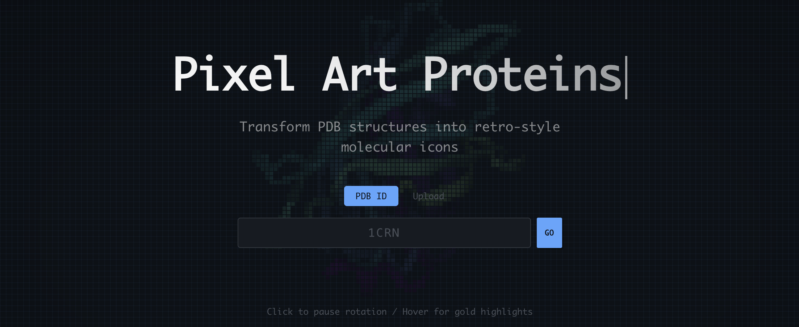
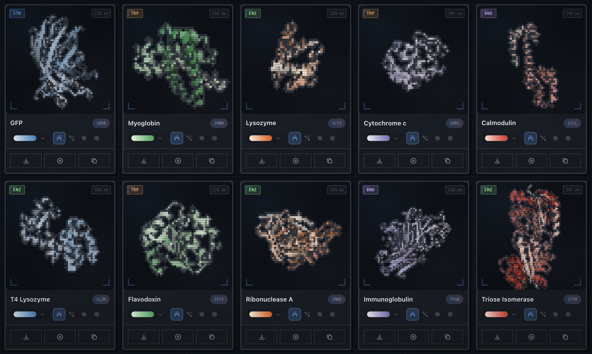

<div align="center">

# RetroMol

Transform protein structures into pixel art

<br />

[**▶ Live Demo**](https://retromol.vercel.app) ・ [MIT License](LICENSE) ・ [Images: CC0](https://creativecommons.org/publicdomain/zero/1.0/)

<br />





</div>

<br />

## Features

Search by PDB ID or upload `.pdb`/`.cif` files. Choose from 20+ color palettes and 4 display styles. Export as transparent PNG or animated GIF. Share via URL. All generated images are CC0 public domain.

## Rendering Pipeline

```
PDB Data → 3Dmol.js → Pixelation → Outline Detection → Canvas
```

1. Load structure from RCSB PDB or user file
2. Render with 3Dmol.js (cartoon/stick/sphere/surface)
3. Apply gradient coloring from N-terminus to C-terminus
4. Pixelate with dynamic resolution based on display size
5. Detect edges and add dark outlines for retro feel
6. Apply CRT scanlines and subtle glow effects

## License

Code: [MIT](LICENSE) / Generated Images: [CC0 1.0](https://creativecommons.org/publicdomain/zero/1.0/)
